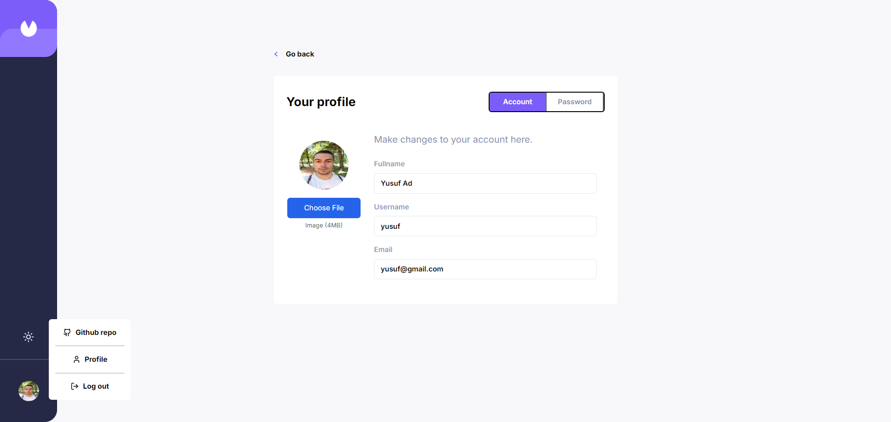

# Invoice App - Frontend Mentor




## Intro

Hello, there! 👋

Thank you for checking out my solution to the [invoice app challenge](https://www.frontendmentor.io/challenges/invoice-app-i7KaLTQjl) from Frontend Mentor.

Feel free to look around and explore! 😉

[Live demo](https://next-invoice-app-vert.vercel.app/)

## Installation

1. **Clone the repository:**

   ```bash
   git clone https://github.com/yusuf-ad/Nextjs-Invoice-App.git
   cd Nextjs-Invoice-App

   ```

2. **Install dependencies:**
   npm install

3. **Set up environment variables:**

   - Change the `.env.example` file to `.env`:

   - Paste your uploadthing key, and mongodb server key

4. **Run the development server:**
   ```bash
   npm run dev
   ```

## Overview

For this challenge, I used...

- [React](https://reactjs.org/) and [Next.js](https://nextjs.org/) (to build out the site)
- [Tailwind CSS](https://tailwindcss.com/) and [shadcn/ui](https://ui.shadcn.com/) (to style it)
- [react-hook-form](https://react-hook-form.com/) (to handle the forms in the site)
- [uploadthing](https://uploadthing.com/) for upload images
- [Upstash](https://upstash.com/) for rate-limiting

## Things I Learned

- **Next.js Page Layout**:  
  I now understand how to effectively utilize the Next.js page layout system to create structured and maintainable web applications.

- **Auth in Next.js**:  
  I have learned how to manage sessions, set cookies, and use Next.js middleware to implement authentication and authorization.

- **Loading State Handling**:  
  I have learned how to handle loading states efficiently, ensuring a smooth user experience.

- **React Server Components**:  
  I delved into React server components and gained a solid understanding of how to use them to improve application performance.

- **Server Actions**:  
  I explored how to implement server actions, optimizing backend processes and making my applications more responsive.

- **Shadcn UI Customization**:  
  I gained hands-on experience with Shadcn UI and learned how to customize its components to better suit the specific needs of my projects.

- **Uploading Images**:
  I learned how to upload images with [uploadthing](https://uploadthing.com/) effectively.

- **Ratelimitting**:
  I learned how to implement rate-limitting with [Upstash](https://upstash.com/)

## Things I Wish I Would Have Done

Looking back, there are a few things I wish I had focused on more before starting my project:

- **Better Planning**:  
  I wish I had spent more time on planning before diving into the development process. A well-thought-out plan could have streamlined my workflow and reduced potential issues later on.

- **Emphasizing Reusable Components**:  
  I should have placed greater emphasis on creating and using reusable components. This would have made my codebase more maintainable and scalable, saving time and effort in the long run.

- **Setting TypeScript Types More Accurately**:  
  I regret not paying closer attention to defining TypeScript types more accurately. Properly setting these types would have helped prevent bugs and made the code more robust and self-documenting.

## Bugs

(a.k.a. things I've been meaning to fix or I need help with) 😅

- **Filter Issue**:  
  When a filter is active and I refresh the page, even after deactivating the filter, the invoices shown are still the ones filtered earlier instead of the default invoices.

- **Loading Spinner Display**:  
  When navigating to the invoice details page, the loading spinner from the main page is still visible, which shouldn't be the case.
